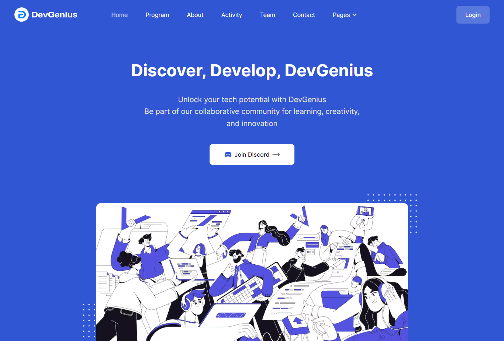

# DevGenius Web Community

## Table Of Contents

- [DevGenius Web Community](#coding-test-finplan-50)

  - [Table Of Contents](#table-of-contents)
  - [Author](#author)
- [Documentation](#documentation)

  - [How To Run?](#how-to-run)
  - [Screenshots](#screenshots)
  - [Notes](#notes)
- [Contact](#contact)

## Author

- [@nadiaalnd](https://github.com/nadiaalnd)

# Documentation

## How To Run?

- Open Terminal or Command Prompt
- Change to the DevGenius Directory
  > ```
  > cd DevGenius
  > ```
- Install Dependensi
  > ```
  > composer install
  > ```
- Copy Configuration File
  > ```
  > cp .env.example .env
  > ```
- Generate Application Key
  > ```
  > php artisan key:generate
  > ```
- Database Migration
  > ```
  > php artisan migrate
  > ```
- Run the command in terminal
  > ```
  > npm run dev
  > ```
- Run the application
  > ```
  > php artisan serve
  > ```
- Open the localhost link to view the running application
    - [Localhost](http://127.0.0.1:8000/)

## Screenshots

Home page view of DevGenius built using Laravel and the Play Tailwind template

  

## Notes

- Ensure you have PHP installed on your system to run this application.
- Make sure you already have Composer to manage Laravel project dependencies.

---

## Contact

- Nadila Aulya Salsabila Mirdianti
- Email : nadila2244@gmail.com
- Instagram : [@nadiaalnd](https://instagram.com/nadiaalnd)
